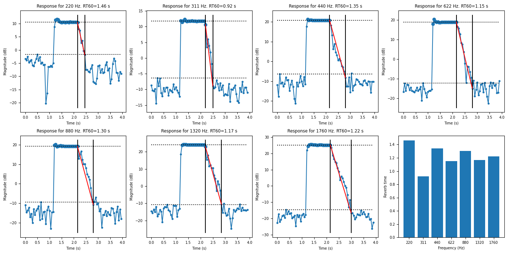

# About

Calculates the room RT60 reverberation time by sending out tones and measuring.

I wrote this scripts because the apps I tried did not work very well for me.



# Usage
```
$ poetry install
$ poetry shell
$ python reverb.py --room=myroom
```

Uses the default speakers and microphone. I used a Yeti Blue microphone set to omnidirectional.